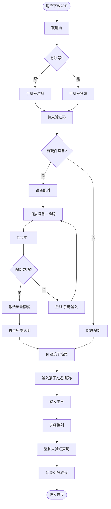
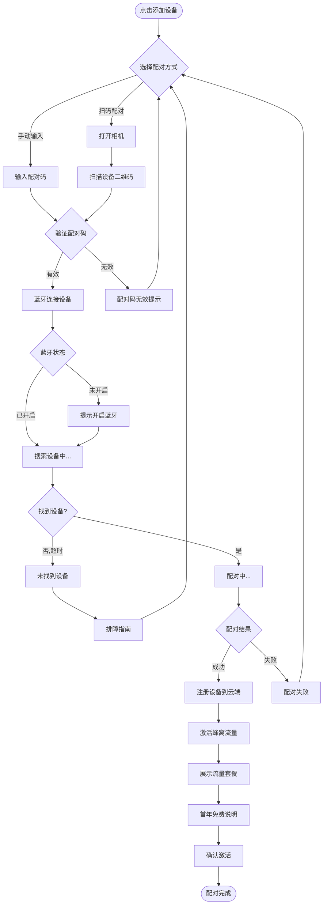
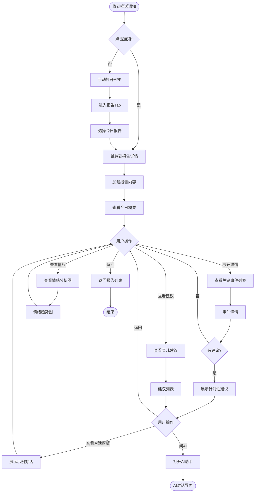
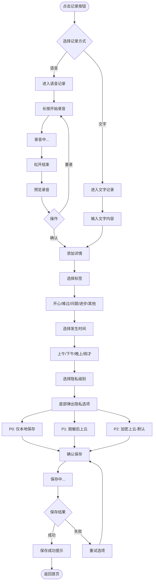
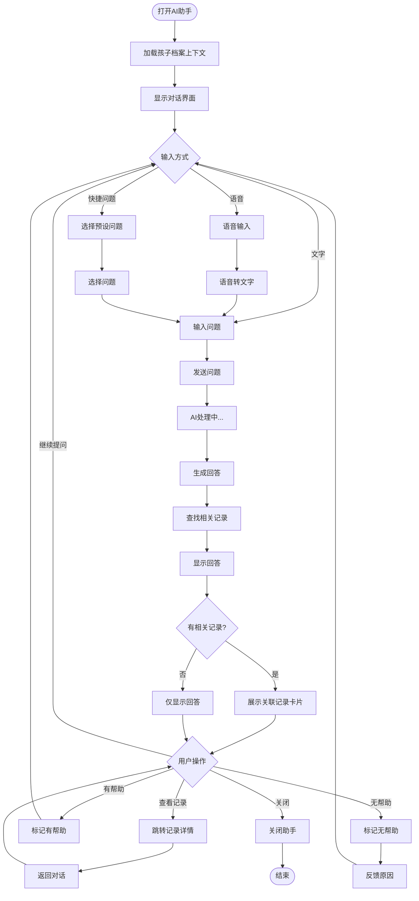
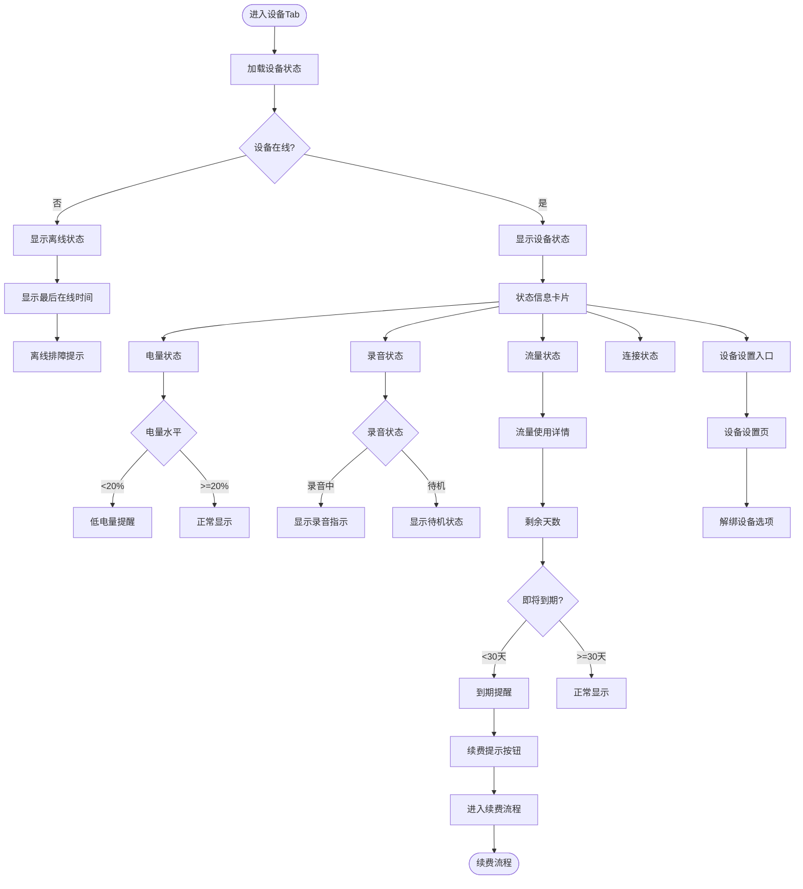
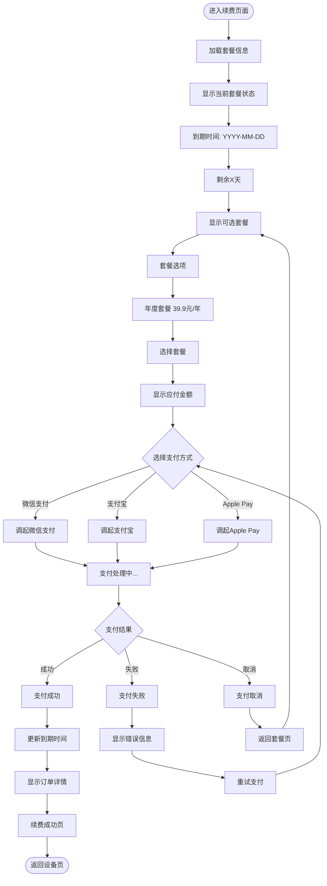
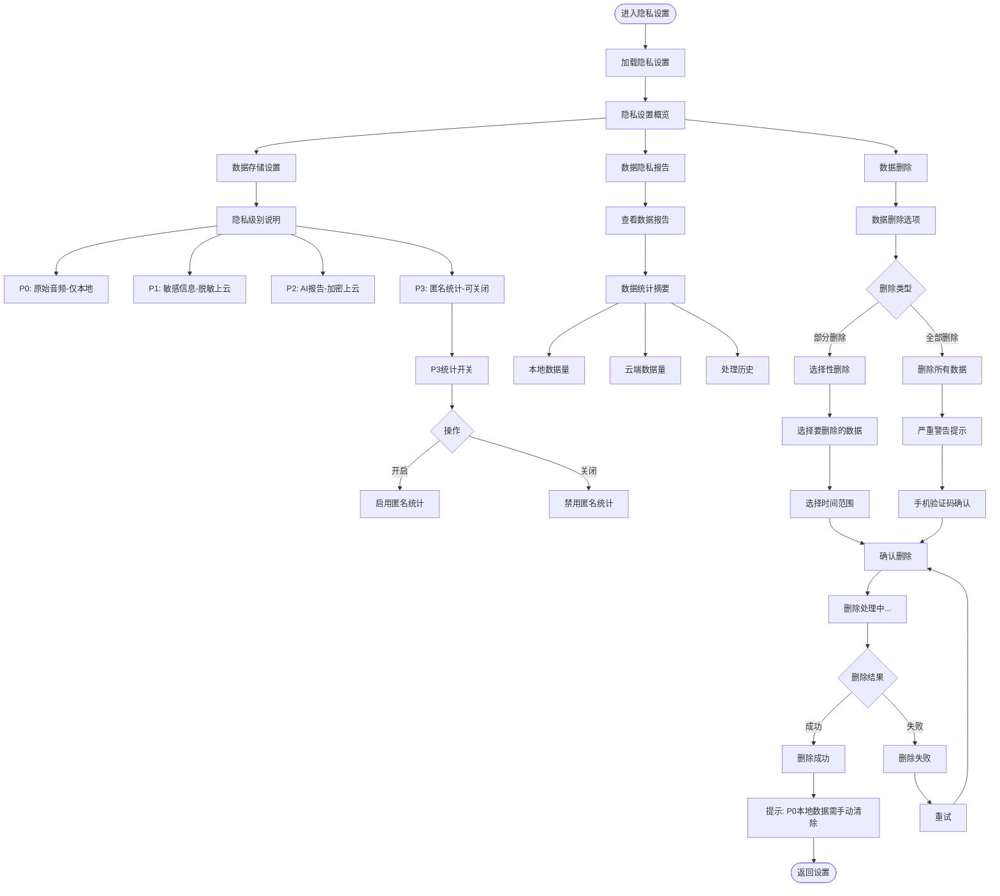
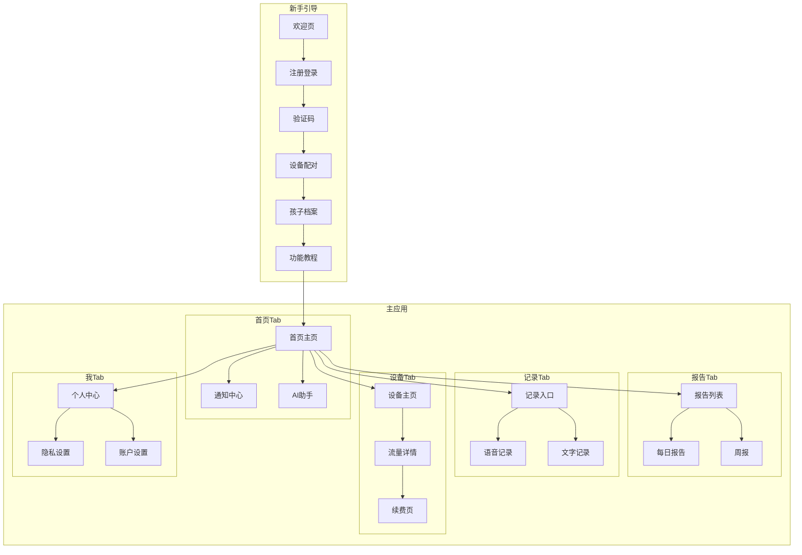

# MVP APP UX设计规格

> **文档版本**：1.0
> **创建日期**：2025-02-05
> **平台**：React Native (iOS + Android)
> **关联文档**：[MVP规格说明](./mvp-specification.md) | [API规格](./api-specification.md) | [隐私框架](../04-privacy-security/privacy-framework.md)

---

## 一、MVP APP 功能范围

### 1.1 功能范围定义

#### MVP 包含功能（Must Have）

| 模块 | 功能 | 优先级 | 说明 |
|------|------|--------|------|
| **新手引导** | 手机号注册/登录 | P0 | 支持验证码登录 |
| | 设备配对 | P0 | 扫码/输入配对码绑定硬件 |
| | 孩子档案创建 | P0 | 姓名、昵称、生日、性别 |
| | 新手教程 | P1 | 功能引导和使用说明 |
| **首页** | 今日概览 | P0 | 实时活动摘要、关键事件 |
| | 实时动态流 | P0 | 孩子当前状态、最新对话摘要 |
| | 快捷入口 | P1 | 快速记录、查看报告 |
| **报告** | 每日报告 | P0 | 今日总结、关键事件、情绪分析 |
| | 育儿建议 | P0 | 针对性沟通建议、对话模板 |
| | 周报 | P1 | 本周成长趋势、话题统计 |
| | 历史报告列表 | P1 | 按日期浏览历史报告 |
| **手动记录** | 语音记录 | P0 | 长按录音，家长补充观察 |
| | 文字记录 | P0 | 文字输入补充信息 |
| | 标签分类 | P1 | 预设标签（开心/难过/问题/进步）|
| | 隐私级别选择 | P1 | P0-P3隐私分级 |
| **AI助手** | 育儿问答 | P0 | 基于孩子档案的个性化问答 |
| | 上下文关联 | P1 | 关联相关记录和报告 |
| **设备管理** | 设备状态 | P0 | 电量、录音状态、在线状态 |
| | 流量管理 | P0 | 流量使用情况、剩余天数 |
| | 续费订阅 | P0 | 流量套餐续费（39.9元/年）|
| | 设备解绑 | P1 | 解除设备绑定 |
| **设置** | 通知设置 | P0 | 推送时间、类型设置 |
| | 隐私设置 | P0 | P0-P3级别控制、数据报告 |
| | 账户管理 | P0 | 个人信息、修改手机号 |
| | 关于与帮助 | P1 | 用户协议、隐私政策、FAQ |

#### MVP 不包含功能（Post-MVP）

| 功能 | 延后原因 | 预计版本 |
|------|---------|---------|
| 家庭共享 | 多用户协作复杂度高 | V1.1 |
| 历史搜索/筛选 | 非核心验证功能 | V1.1 |
| 数据导出 | 运营优先级低 | V1.2 |
| 月报 | 需要足够数据积累 | V1.1 |
| 社区功能 | 与核心价值无关 | V2.0 |

### 1.2 核心价值主张

```
┌─────────────────────────────────────────────────────────────────────────────┐
│                         APP 核心价值                                         │
├─────────────────────────────────────────────────────────────────────────────┤
│                                                                             │
│   "不仅了解孩子，更知道如何与孩子互动"                                        │
│                                                                             │
│   ┌─────────────────────────────┐   ┌─────────────────────────────┐        │
│   │      了解孩子               │   │      教育引导               │        │
│   │      ─────────────────      │   │      ─────────────────      │        │
│   │  • 今天聊了什么话题         │   │  • 如何和孩子聊这件事        │        │
│   │  • 孩子的兴趣爱好           │   │  • 对话方式建议              │        │
│   │  • 开心/不开心的事          │   │  • 教育方式引导              │        │
│   │  • 好奇心问题               │   │  • 话题切入点建议            │        │
│   │  • 情绪状态分析             │   │  • 示例对话模板              │        │
│   └─────────────────────────────┘   └─────────────────────────────┘        │
│                                                                             │
└─────────────────────────────────────────────────────────────────────────────┘
```

---

## 二、信息架构

> **更新日期**：2025-02-05
> **重大变更**：从5 Tab简化为3 Tab架构

### 2.1 Tab Bar 导航结构（3 Tab）

```
┌─────────────────────────────────────────────────────────────────────────────┐
│                         APP 导航结构（3 Tab 极简版）                         │
├─────────────────────────────────────────────────────────────────────────────┤
│                                                                             │
│        ┌─────────────┐      ┌─────────────┐      ┌─────────────┐           │
│        │    首页     │      │    记录     │      │    我的     │           │
│        │    Home     │      │   Records   │      │    Mine     │           │
│        │     🏠      │      │     💬      │      │     👤      │           │
│        └─────────────┘      └─────────────┘      └─────────────┘           │
│                                                                             │
│        今日报告总览           对话信息流           孩子档案                   │
│        设备状态               话题总结             设备管理                   │
│        今日精选               AI对话入口           账号设置                   │
│        互动策略 ⭐            最了解孩子的AI ⭐    隐私/通知                  │
│                                                                             │
│        "看一眼就懂"           "深度探索+对话"      "管理配置"                 │
│                                                                             │
└─────────────────────────────────────────────────────────────────────────────┘
```

### 2.2 页面层级结构

```
APP
├── 新手引导流程（首次启动）
│   ├── 欢迎页
│   ├── 注册/登录
│   ├── 设备配对
│   ├── 孩子档案创建
│   └── 功能教程
│
├── Tab: 🏠 首页 (Home) - 快速了解
│   ├── 设备状态胶囊
│   ├── 今日报告总览卡片
│   │   ├── 一句话总结
│   │   ├── 情绪状态
│   │   └── 话题标签
│   ├── 今日精选动态（2-3条）
│   ├── 互动策略卡片 ⭐
│   │   ├── 育儿建议
│   │   └── 对话模板
│   └── >> 报告详情页
│
├── Tab: 💬 记录 (Records) - 深度探索 + AI对话
│   ├── 话题总览（标签云）
│   ├── 对话信息流
│   │   ├── 时间线展示
│   │   ├── 对话原文
│   │   └── AI洞察标注
│   ├── >> 话题详情页
│   └── AI对话窗口 ⭐⭐ (底部固定入口)
│       ├── 文字输入
│       ├── 语音输入
│       └── "最了解孩子的AI"
│
└── Tab: 👤 我的 (Mine) - 管理配置
    ├── 孩子管理
    │   ├── 基本信息
    │   └── 兴趣标签
    ├── 设备管理
    │   ├── 设备状态
    │   ├── 流量管理/续费
    │   └── 固件更新
    ├── 通知设置
    ├── 隐私设置
    ├── 账户设置
    └── 帮助与关于
```

### 2.3 3 Tab设计理念

| Tab | 核心价值 | 使用频率 | 用户心智 |
|-----|---------|---------|---------|
| **首页** | 快速了解孩子+获取互动建议 | 高（每日多次） | "看一眼就知道今天怎么回事" |
| **记录** | 深度探索+和AI对话 | 中（需要时） | "我想更了解孩子/问AI问题" |
| **我的** | 设置和管理 | 低（偶尔） | "改个设置/看看设备" |

---

## 三、用户旅程流程

### 3.1 首次用户引导流程

**场景**：新用户首次下载APP，完成注册和设备配对



**关键步骤说明**：

| 步骤 | 说明 | 异常处理 |
|------|------|---------|
| 手机号注册 | 输入手机号+验证码，60秒倒计时 | 验证码错误提示，重发按钮 |
| 设备配对 | 扫描设备底部二维码或手动输入配对码 | 配对失败提示，重试选项 |
| 流量激活 | 展示首年免费信息，告知续费价格 | - |
| 孩子档案 | 必填：昵称、生日；选填：真实姓名、性别 | 字段校验提示 |
| 监护人验证 | 阅读并勾选监护人声明 | 必须勾选才能继续 |

### 3.2 设备配对流程

**场景**：用户购买新设备后进行配对



**配对码格式**：8位字母数字组合，印刷在设备底部

### 3.3 每日报告消费流程

**场景**：晚间收到每日报告推送，查看报告详情



**推送时机**：每日20:00推送当日报告

### 3.4 手动记录创建流程

**场景**：家长补充记录孩子今天发生的事



**录音限制**：单次最长5分钟，超时自动保存

### 3.5 AI助手交互流程

**场景**：家长向AI提问育儿问题



**预设快捷问题示例**：
- "孩子最近对什么感兴趣？"
- "如何回应孩子的这个问题？"
- "孩子今天的情绪怎么样？"
- "有什么适合和孩子聊的话题？"

### 3.6 设备状态查看流程

**场景**：家长查看硬件设备状态



### 3.7 流量订阅续费流程

**场景**：用户续费设备蜂窝流量套餐



**套餐信息**：
- 首年免费（随设备赠送）
- 续费价格：39.9元/年
- 支持：微信支付、支付宝、Apple Pay

### 3.8 隐私设置管理流程

**场景**：用户管理数据隐私设置



---

## 四、页面清单

### 4.1 页面总览

共计 **31** 个页面

| 模块 | 页面数量 | 页面列表 |
|------|---------|---------|
| 新手引导 | 7 | 欢迎页、注册登录、验证码、设备配对、配对中、孩子档案、教程 |
| 首页 | 4 | 首页主页、通知中心、AI助手、AI对话详情 |
| 报告 | 5 | 报告列表、每日报告、周报、事件详情、建议详情 |
| 记录 | 4 | 记录入口、语音记录、文字记录、标签隐私选择 |
| 设备 | 5 | 设备主页、流量详情、续费页、支付结果、设备设置 |
| 设置 | 6 | 个人中心、孩子档案管理、通知设置、隐私设置、账户设置、关于帮助 |

### 4.2 详细页面清单

#### 新手引导模块（7页）

| 序号 | 页面名称 | 页面ID | 说明 |
|------|---------|--------|------|
| 1 | 欢迎页 | `onboarding_welcome` | APP介绍、开始按钮 |
| 2 | 注册/登录 | `onboarding_auth` | 手机号输入、获取验证码 |
| 3 | 验证码输入 | `onboarding_verify` | 验证码输入、倒计时重发 |
| 4 | 设备配对 | `onboarding_pair` | 扫码配对、手动输入入口 |
| 5 | 配对进行中 | `onboarding_pairing` | 配对状态、进度指示 |
| 6 | 孩子档案创建 | `onboarding_profile` | 孩子信息输入、监护人声明 |
| 7 | 功能教程 | `onboarding_tutorial` | 滑动引导、跳过按钮 |

#### 首页模块（4页）

| 序号 | 页面名称 | 页面ID | 说明 |
|------|---------|--------|------|
| 8 | 首页主页 | `home_main` | 今日概览、实时动态、快捷入口 |
| 9 | 通知中心 | `home_notifications` | 通知列表、已读/未读状态 |
| 10 | AI助手 | `home_ai_assistant` | 对话界面、输入框、快捷问题 |
| 11 | AI对话详情 | `home_ai_detail` | 单条对话详情、关联记录 |

#### 报告模块（5页）

| 序号 | 页面名称 | 页面ID | 说明 |
|------|---------|--------|------|
| 12 | 报告列表 | `reports_list` | 日历视图、报告列表 |
| 13 | 每日报告 | `reports_daily` | 今日总结、关键事件、情绪、建议 |
| 14 | 周报 | `reports_weekly` | 本周趋势、话题统计、成长亮点 |
| 15 | 事件详情 | `reports_event` | 事件描述、时间、相关建议 |
| 16 | 建议详情 | `reports_suggestion` | 详细建议、对话模板、AI入口 |

#### 记录模块（4页）

| 序号 | 页面名称 | 页面ID | 说明 |
|------|---------|--------|------|
| 17 | 记录入口 | `record_entry` | 语音/文字选择 |
| 18 | 语音记录 | `record_voice` | 长按录音、波形显示、预览 |
| 19 | 文字记录 | `record_text` | 文字输入、字数统计 |
| 20 | 标签隐私选择 | `record_details` | 标签选择、时间、隐私级别 |

#### 设备模块（5页）

| 序号 | 页面名称 | 页面ID | 说明 |
|------|---------|--------|------|
| 21 | 设备主页 | `device_main` | 设备状态卡片、流量、电量 |
| 22 | 流量详情 | `device_traffic` | 流量使用、到期时间、续费入口 |
| 23 | 续费页 | `device_renew` | 套餐选择、支付方式 |
| 24 | 支付结果 | `device_pay_result` | 成功/失败状态、订单详情 |
| 25 | 设备设置 | `device_settings` | 设备名称、解绑设备 |

#### 设置模块（6页）

| 序号 | 页面名称 | 页面ID | 说明 |
|------|---------|--------|------|
| 26 | 个人中心 | `me_main` | 用户信息、菜单入口 |
| 27 | 孩子档案管理 | `me_child_profile` | 编辑孩子信息 |
| 28 | 通知设置 | `me_notifications` | 推送开关、推送时间 |
| 29 | 隐私设置 | `me_privacy` | 隐私级别、数据报告、删除数据 |
| 30 | 账户设置 | `me_account` | 修改手机号、注销账户 |
| 31 | 关于与帮助 | `me_about` | 版本、协议、FAQ、客服 |

---

## 五、导航规格

### 5.1 导航类型

```
┌─────────────────────────────────────────────────────────────────────────────┐
│                              导航架构                                        │
├─────────────────────────────────────────────────────────────────────────────┤
│                                                                             │
│   ┌─────────────────────────────────────────────────────────────────────┐  │
│   │                      根导航 (Root Navigator)                         │  │
│   │                                                                      │  │
│   │   新手引导流程 ──────────────────▶ 主应用                             │  │
│   │   (首次启动)                       (已登录)                          │  │
│   └─────────────────────────────────────────────────────────────────────┘  │
│                                                                             │
│   ┌─────────────────────────────────────────────────────────────────────┐  │
│   │                    主应用 Tab Navigator                              │  │
│   │                                                                      │  │
│   │   ┌────────┬────────┬────────┬────────┬────────┐                    │  │
│   │   │ 首页   │ 报告   │ 记录   │ 设备   │  我    │                    │  │
│   │   │ Stack  │ Stack  │ Stack  │ Stack  │ Stack  │                    │  │
│   │   └────────┴────────┴────────┴────────┴────────┘                    │  │
│   └─────────────────────────────────────────────────────────────────────┘  │
│                                                                             │
│   ┌─────────────────────────────────────────────────────────────────────┐  │
│   │                    Modal 呈现                                        │  │
│   │                                                                      │  │
│   │   • AI助手对话                                                       │  │
│   │   • 语音记录                                                         │  │
│   │   • 续费支付                                                         │  │
│   │   • 隐私级别选择（底部弹出）                                          │  │
│   └─────────────────────────────────────────────────────────────────────┘  │
│                                                                             │
└─────────────────────────────────────────────────────────────────────────────┘
```

### 5.2 导航详细规格

| 导航类型 | 使用场景 | 技术实现 |
|---------|---------|---------|
| **Tab Navigator** | 5个主Tab切换 | `@react-navigation/bottom-tabs` |
| **Stack Navigator** | Tab内页面跳转 | `@react-navigation/stack` |
| **Modal** | AI助手、语音记录、支付 | `presentation: 'modal'` |
| **Bottom Sheet** | 隐私级别选择、标签选择 | `@gorhom/bottom-sheet` |

### 5.3 深度链接支持

| 场景 | 链接格式 | 目标页面 |
|------|---------|---------|
| 每日报告推送 | `littlestar://reports/daily/{date}` | 每日报告详情 |
| 设备状态提醒 | `littlestar://device/status` | 设备主页 |
| 续费提醒 | `littlestar://device/renew` | 续费页 |
| 通用首页 | `littlestar://home` | 首页主页 |

### 5.4 页面转场动画

| 转场类型 | 使用场景 | 动画效果 |
|---------|---------|---------|
| 水平滑动 | Stack内页面跳转 | 从右向左滑入 |
| 垂直滑动 | Modal弹出 | 从下向上滑入 |
| 淡入淡出 | Tab切换 | 透明度渐变 |
| 底部弹出 | Bottom Sheet | 从底部弹出 |

---

## 六、关键交互模式

### 6.1 手势交互

| 手势 | 场景 | 行为 |
|------|------|------|
| **下拉刷新** | 首页、报告列表 | 刷新数据，显示加载指示器 |
| **长按** | 语音记录按钮 | 开始录音，松开结束 |
| **左右滑动** | 每日报告 | 切换前一天/后一天报告 |
| **上滑** | Bottom Sheet | 展开更多选项 |
| **下滑** | Modal页面 | 关闭Modal |

### 6.2 按钮与入口

| 元素 | 位置 | 功能 |
|------|------|------|
| **浮动记录按钮** | 首页右下角 | 快速进入记录页面 |
| **AI助手入口** | 首页右上角 | 打开AI对话Modal |
| **通知图标** | 首页左上角 | 进入通知中心 |
| **设置图标** | 个人中心右上角 | 进入设置页面 |

### 6.3 反馈模式

| 场景 | 反馈类型 | 说明 |
|------|---------|------|
| 操作成功 | Toast提示 | 底部短暂提示，自动消失 |
| 操作失败 | Alert弹窗 | 需要用户确认，可重试 |
| 加载中 | Loading指示器 | 全屏或局部加载动画 |
| 空状态 | 空状态插画 | 友好提示+引导操作 |
| 网络错误 | 错误页面 | 重试按钮+错误说明 |

### 6.4 录音交互细节

```
┌─────────────────────────────────────────────────────────────────────────────┐
│                           语音记录交互                                       │
├─────────────────────────────────────────────────────────────────────────────┤
│                                                                             │
│   状态流转：                                                                 │
│                                                                             │
│   ┌────────┐     长按      ┌────────┐     松开      ┌────────┐             │
│   │ 待录音  │ ──────────▶ │ 录音中  │ ──────────▶ │  预览   │             │
│   │        │              │        │              │        │             │
│   │  ○     │              │  ◉     │              │  ▶     │             │
│   │ 按住说话│              │ 正在录音│              │ 播放预览│             │
│   └────────┘              └────────┘              └────────┘             │
│                               │                       │                    │
│                               │ 上滑取消              │ 重录               │
│                               ▼                       ▼                    │
│                          ┌────────┐              ┌────────┐               │
│                          │ 已取消  │              │ 待录音  │               │
│                          └────────┘              └────────┘               │
│                                                                             │
│   视觉反馈：                                                                 │
│   • 录音中：按钮放大、波形动画、时间计数                                       │
│   • 上滑取消：按钮变红、提示文字                                              │
│   • 预览中：播放进度条、波形静态显示                                          │
│                                                                             │
│   限制：                                                                     │
│   • 单次最长5分钟                                                            │
│   • 超时自动保存                                                             │
│                                                                             │
└─────────────────────────────────────────────────────────────────────────────┘
```

### 6.5 隐私级别选择交互

```
┌─────────────────────────────────────────────────────────────────────────────┐
│                      隐私级别选择（底部弹出）                                  │
├─────────────────────────────────────────────────────────────────────────────┤
│                                                                             │
│   ┌─────────────────────────────────────────────────────────────────────┐  │
│   │  选择隐私级别                                                 [关闭] │  │
│   │  ─────────────────────────────────────────────────────────────────  │  │
│   │                                                                      │  │
│   │  ┌─────────────────────────────────────────────────────────────┐   │  │
│   │  │  ○  P0 - 仅本地保存                                         │   │  │
│   │  │     原始内容永不上传，最高隐私保护                            │   │  │
│   │  └─────────────────────────────────────────────────────────────┘   │  │
│   │                                                                      │  │
│   │  ┌─────────────────────────────────────────────────────────────┐   │  │
│   │  │  ○  P1 - 脱敏后上云                                         │   │  │
│   │  │     敏感信息脱敏处理后同步云端                                │   │  │
│   │  └─────────────────────────────────────────────────────────────┘   │  │
│   │                                                                      │  │
│   │  ┌─────────────────────────────────────────────────────────────┐   │  │
│   │  │  ●  P2 - 加密上云（推荐）                                    │   │  │
│   │  │     加密存储到云端，支持AI分析生成报告                        │   │  │
│   │  └─────────────────────────────────────────────────────────────┘   │  │
│   │                                                                      │  │
│   │                                           [确认选择]                 │  │
│   └─────────────────────────────────────────────────────────────────────┘  │
│                                                                             │
│   默认选中：P2（加密上云）                                                   │
│   选择P0时提示：此记录将不会出现在AI报告中                                    │
│                                                                             │
└─────────────────────────────────────────────────────────────────────────────┘
```

---

## 七、状态处理

### 7.1 加载状态

| 场景 | 加载方式 | 说明 |
|------|---------|------|
| 首次进入页面 | 全屏骨架屏 | 保持布局，内容占位 |
| 下拉刷新 | 顶部刷新指示器 | 不遮挡现有内容 |
| 按钮操作 | 按钮内Loading | 按钮禁用，显示转圈 |
| 支付处理 | 全屏Loading | 阻止用户其他操作 |

### 7.2 空状态

| 页面 | 空状态说明 | 引导操作 |
|------|-----------|---------|
| 首页-无设备 | "还没有绑定设备" | 去绑定设备 |
| 首页-无数据 | "今天还没有记录" | 小星伴正在倾听... |
| 报告列表 | "还没有报告" | 报告将在晚间8点生成 |
| 通知中心 | "暂无通知" | 无需引导 |
| AI对话 | "有什么想问的？" | 显示快捷问题 |

### 7.3 错误状态

| 错误类型 | 处理方式 | 用户操作 |
|---------|---------|---------|
| 网络错误 | 错误页面 | 重试按钮 |
| 服务器错误 | Toast提示 | 自动重试或手动重试 |
| 登录过期 | 跳转登录页 | 重新登录 |
| 权限拒绝 | 弹窗说明 | 去设置开启 |
| 支付失败 | 弹窗提示 | 重试或取消 |

---

## 八、技术实现参考

### 8.1 技术栈

| 类别 | 技术选型 |
|------|---------|
| 框架 | React Native 0.73+ |
| 导航 | React Navigation 6.x |
| 状态管理 | Zustand / Redux Toolkit |
| 网络请求 | Axios / React Query |
| UI组件 | 自定义组件 + React Native Paper |
| 动画 | React Native Reanimated 3 |
| 蓝牙 | react-native-ble-plx |
| 录音 | react-native-audio-recorder-player |
| 推送 | 极光推送 / Firebase |
| 支付 | 微信SDK / 支付宝SDK |

### 8.2 目录结构建议

```
src/
├── navigation/           # 导航配置
│   ├── RootNavigator.tsx
│   ├── TabNavigator.tsx
│   └── stacks/
├── screens/              # 页面组件
│   ├── onboarding/
│   ├── home/
│   ├── reports/
│   ├── record/
│   ├── device/
│   └── settings/
├── components/           # 通用组件
│   ├── common/
│   ├── cards/
│   └── modals/
├── hooks/                # 自定义Hooks
├── services/             # API服务
├── stores/               # 状态管理
├── utils/                # 工具函数
├── assets/               # 静态资源
└── types/                # TypeScript类型
```

---

## 附录：页面流转图


