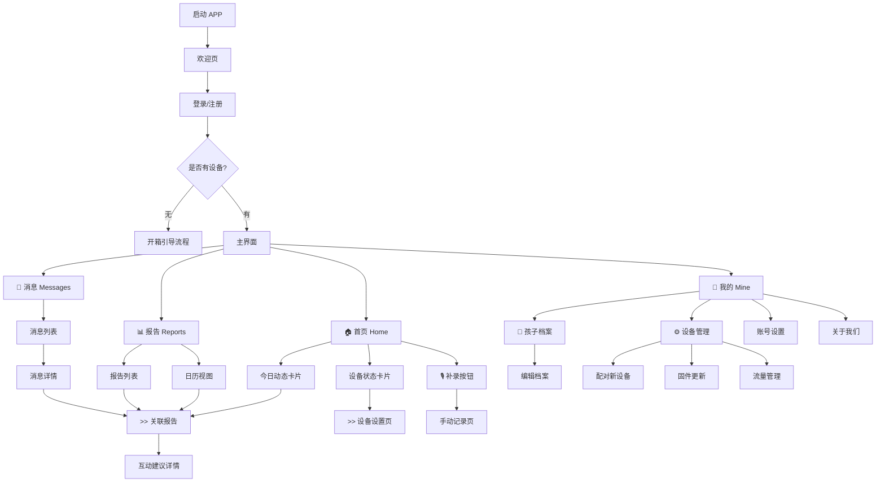
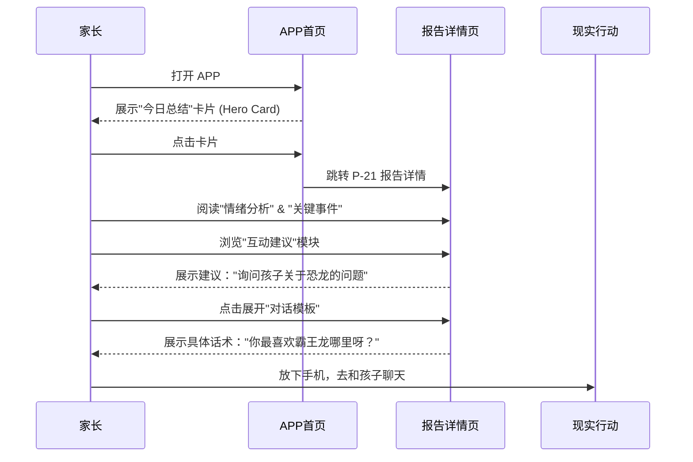
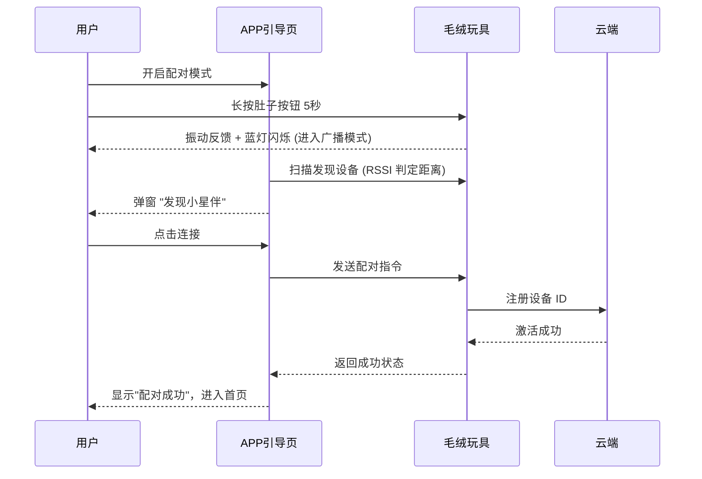

# APP 信息架构 (Information Architecture)

> **关联文档**：
> - [APP功能规格](./01-app-features.md)
> - [用户旅程地图](./02-user-journey.md)

---

## 一、全局导航设计

### 1.1 导航模式
采用 **底部标签栏 (Bottom Tab Bar)** 作为一级导航，辅以 **顶部导航栏 (Top Navigation Bar)** 进行层级深入。

### 1.2 底部标签定义 (Tab Bar)

| 图标 | 名称 | 核心功能 | 选中态说明 |
|------|------|---------|-----------|
| 🏠 | **首页 (Home)** | 设备状态、今日概览、快捷入口 | 展示当前时刻最重要的信息 |
| 📊 | **报告 (Reports)** | 历史日报、趋势分析、日历视图 | 查阅和回顾成长轨迹 |
| 💬 | **消息 (Messages)** | 实时对话摘要、系统通知 | 碎片化的即时动态流 |
| 👤 | **我的 (Mine)** | 设备管理、孩子档案、设置 | 低频但必要的配置项 |

---

## 二、站点地图 (Site Map)

---

## 三、页面详细结构

### 3.1 启动与引导 (Onboarding)

#### P-01 登录页
*   **输入**：手机号、验证码
*   **动作**：登录/注册、微信一键登录
*   **隐私**：勾选隐私协议

#### P-02 设置向导 (Wizard)
*   **Step 1 孩子信息**：姓名、昵称、生日、性别 (表单)
*   **Step 2 设备配对**：扫描查找/蓝牙列表 -> 正在连接 -> 成功动画
*   **Step 3 流量激活**：套餐展示 -> 确认激活 -> 激活结果

---

### 3.2 🏠 首页 (Home)

> **设计目标**：一眼看清"孩子今天怎么了"和"设备好不好"。

#### P-10 首页概览
*   **顶部栏**
    *   左侧：孩子头像切换 (多孩子场景)
    *   右侧：消息入口 (带红点)
*   **区域 1：设备状态胶囊 (Device Status)**
    *   状态：在线/离线/充电中
    *   电量：图标 + 百分比
    *   网络：信号强度
    *   *点击跳转*：P-42 设备详情
*   **区域 2：今日情绪/天气 (Hero Card)**
    *   动态插画：根据孩子今日情绪通过 IP 形象展示 (如开心的星星)
    *   文案："今天小明很开心，和朋友聊了很多话题。"
*   **区域 3：实时动态流 (Feed)**
    *   时间轴展示今日的关键录音摘要、抓拍图片(如有)
    *   单条卡片：时间 + 事件摘要 + 关键标签
    *   *点击跳转*：P-31 消息详情
*   **悬浮按钮 (FAB)**
    *   🎙️ **记录**：P-11 手动记录页

#### P-11 手动记录页
*   **功能**：补充APP无法采集的线下事件
*   **输入**：长按语音录入、文本输入
*   **选项**：发生时间、相关标签
*   **输出**：保存并触发 AI 分析更新

---

### 3.3 📊 报告 (Reports)

> **设计目标**：结构化展示成长数据，提供高价值的育儿指导。

#### P-20 报告列表页
*   **顶部栏**：视图切换 (日历/列表)
*   **日历视图**：
    *   月历展示，有记录的日期标注情绪颜色点
*   **列表视图**：
    *   卡片流：日期 + 摘要 + 关键标签 (如 #恐龙 #乐高)
    *   *点击跳转*：P-21 报告详情

#### P-21 报告详情页 (核心价值页)
*   **Header**：日期、星期、天气
*   **模块 A：今日总结** (文本卡片)
*   **模块 B：情绪分析** (环形图/情绪脸谱)
*   **模块 C：话题云** (Tag Cloud)
*   **模块 D：互动建议 (Actionable Insight)**
    *   卡片列表，每张卡片针对一个具体事件
    *   内容：事件回顾 + 原理分析 + **建议行动**
    *   *交互*：点击展开查看"对话模板"
*   **模块 E：对话模板 (Script)**
    *   剧本式对话参考 (Q & A 风格)

---

### 3.4 💬 消息 (Messages)

> **设计目标**：实时感知的窗口，让家长不错过精彩瞬间。

#### P-30 消息列表
*   **类型**：系统通知、对话推送、电量提醒
*   **样式**：标准列表 (Icon + Title + Desc + Time)

#### P-31 消息详情
*   **内容**：对话的详细文字摘要
*   **上下文**：当时的情境描述
*   **关联**：链接到当天的完整报告

---

### 3.5 👤 我的 (Mine)

#### P-40 个人中心
*   **用户信息**：头像、昵称
*   **功能列表**：
    *   孩子管理 (P-41)
    *   设备管理 (P-42)
    *   家庭成员 (邀请/管理)
    *   通用设置 (推送、隐私)

#### P-41 孩子档案
*   **基本信息**：编辑姓名、生日
*   **兴趣图谱**：AI 总结的动态兴趣标签云 (可人工删除/置顶)

#### P-42 设备管理
*   **面板**：实时电量、信号、存储空间
*   **操作**：
    *   流量充值/查询
    *   固件更新 (OTA)
    *   设备解绑
    *   寻找设备 (播放声音)

---

## 四、核心交互流程 (User Flow)

### 4.1 报告查看与行动流程

### 4.2 设备配对流程 (BLE + Cloud)

---

## 五、下一步

*   基于此架构图，设计关键页面的 **UI 线框图 (Wireframes)**。
*   优先设计：P-10 首页、P-21 报告详情页、P-02 配对流程。