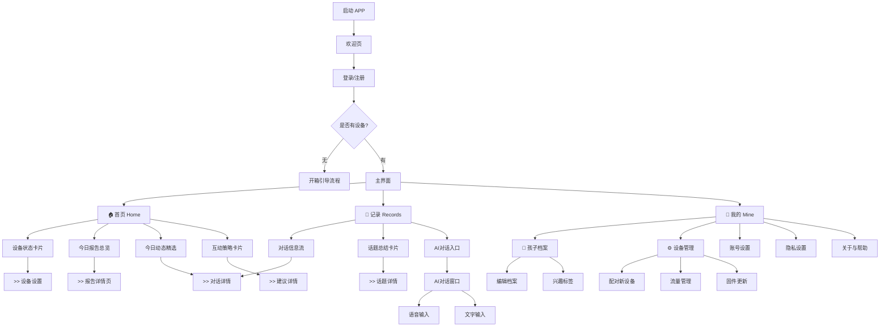
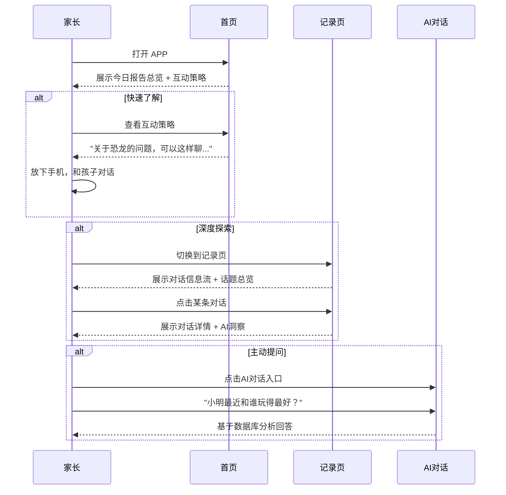
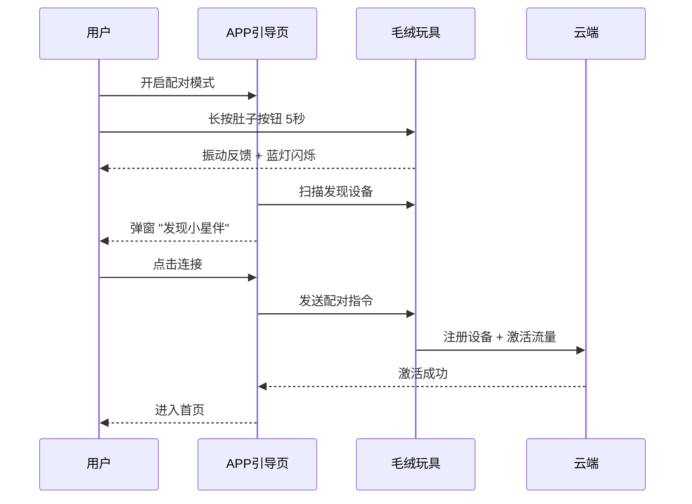

# APP 信息架构 (Information Architecture)

> **关联文档**：
> - [APP功能规格](./01-app-features.md)
> - [用户旅程地图](./02-user-journey.md)
> 
> **更新日期**：2025-02-05
> **重大变更**：从4 Tab简化为3 Tab结构

---

## 一、全局导航设计

### 1.1 导航模式
采用 **底部标签栏 (Bottom Tab Bar)** 作为一级导航，仅 **3个Tab**，极简设计。

### 1.2 底部标签定义 (Tab Bar)

| 图标 | 名称 | 核心功能 | 设计理念 |
|------|------|---------|----------|
| 🏠 | **首页 (Home)** | 设备状态、报告总览、今日精选、互动策略 | 一眼看清"孩子今天怎么了"+"怎么和孩子聊" |
| 💬 | **记录 (Records)** | 对话信息流、精选内容、AI对话、话题总结 | 最了解孩子的AI，父母可直接对话 |
| 👤 | **我的 (Mine)** | 孩子档案、设备管理、账号设置 | 低频但必要的配置项 |

### 1.3 设计理念

```
┌─────────────────────────────────────────────────────────────────────────────┐
│                           3 Tab 极简导航                                     │
├─────────────────────────────────────────────────────────────────────────────┤
│                                                                             │
│   ┌─────────────────┐  ┌─────────────────┐  ┌─────────────────┐            │
│   │      首页       │  │      记录       │  │      我的       │            │
│   │      Home       │  │     Records     │  │      Mine       │            │
│   │       🏠        │  │       💬        │  │       👤        │            │
│   └─────────────────┘  └─────────────────┘  └─────────────────┘            │
│                                                                             │
│   今日报告总览          孩子的数据库          设置与管理                      │
│   设备状态              对话信息流            孩子档案                        │
│   互动策略              AI对话入口            设备管理                        │
│   快速了解              深度探索              账号设置                        │
│                                                                             │
│   "看一眼就懂"          "深入了解+对话"       "管理配置"                      │
│                                                                             │
└─────────────────────────────────────────────────────────────────────────────┘
```

---

## 二、站点地图 (Site Map)



---

## 三、页面详细结构

### 3.1 启动与引导 (Onboarding)

#### P-01 登录页
*   **输入**：手机号、验证码
*   **动作**：登录/注册、微信一键登录
*   **隐私**：勾选隐私协议

#### P-02 设置向导 (Wizard)
*   **Step 1 孩子信息**：姓名、昵称、生日、性别 (表单)
*   **Step 2 设备配对**：扫描查找/蓝牙列表 -> 正在连接 -> 成功动画
*   **Step 3 流量激活**：套餐展示 -> 确认激活 -> 激活结果

---

### 3.2 🏠 首页 (Home)

> **设计目标**：一眼看清"孩子今天怎么了" + "怎么和孩子互动"。

#### P-10 首页主界面

```
┌─────────────────────────────────────────────────────────────┐
│  [👶 小明 ▼]                              [设备状态胶囊]    │
├─────────────────────────────────────────────────────────────┤
│                                                             │
│  ┌─────────────────────────────────────────────────────┐   │
│  │  📊 今日报告总览                                      │   │
│  │  ─────────────────────────────────────────────────  │   │
│  │  "今天小明充满好奇心，问了很多关于恐龙的问题..."       │   │
│  │  情绪：😊 开心  |  话题：#恐龙 #积木 #小红            │   │
│  │                                     [查看完整报告 >]  │   │
│  └─────────────────────────────────────────────────────┘   │
│                                                             │
│  ┌─────────────────────────────────────────────────────┐   │
│  │  🎯 今日精选动态                              [全部 >] │   │
│  │  ─────────────────────────────────────────────────  │   │
│  │  • 14:30 "霸王龙为什么手那么短？" #好奇              │   │
│  │  • 11:15  画画遇到困难，有点沮丧 #情绪               │   │
│  └─────────────────────────────────────────────────────┘   │
│                                                             │
│  ┌─────────────────────────────────────────────────────┐   │
│  │  💡 互动策略                              [2条新建议]  │   │
│  │  ─────────────────────────────────────────────────  │   │
│  │  📌 关于恐龙的兴趣                                   │   │
│  │     "趁热打铁，问问他最喜欢哪种恐龙..."               │   │
│  │                                                      │   │
│  │  📌 关于画画的挫折                                   │   │
│  │     "先倾听，不要直接给建议..."                       │   │
│  └─────────────────────────────────────────────────────┘   │
│                                                             │
├─────────────────────────────────────────────────────────────┤
│  [🏠 首页]           [💬 记录]           [👤 我的]         │
└─────────────────────────────────────────────────────────────┘
```

**首页模块说明**：

| 模块 | 内容 | 数据来源 | 交互 |
|------|------|---------|------|
| **设备状态胶囊** | 在线状态、电量、信号 | `Device` | 点击→设备管理 |
| **今日报告总览** | AI总结+情绪+话题标签 | `DailyReport` | 点击→报告详情 |
| **今日精选动态** | 2-3条关键对话/事件 | `Conversations` | 点击→对话详情 |
| **互动策略** | 针对今日事件的育儿建议 | `Suggestions` | 点击→建议详情+对话模板 |

---

### 3.3 💬 记录 (Records) - 核心交互区

> **设计目标**：这是"最了解孩子的AI"，父母可以深度探索孩子的世界，也可以直接和AI对话。

#### P-20 记录主界面

```
┌─────────────────────────────────────────────────────────────┐
│  记录                                        [🔍 搜索]      │
├─────────────────────────────────────────────────────────────┤
│                                                             │
│  ┌─────────────────────────────────────────────────────┐   │
│  │  📂 话题总览                                         │   │
│  │  ─────────────────────────────────────────────────  │   │
│  │  [#恐龙 12次] [#幼儿园 8次] [#积木 6次] [#小红 5次]  │   │
│  │  [#画画 4次] [#睡觉 3次] [更多...]                   │   │
│  └─────────────────────────────────────────────────────┘   │
│                                                             │
│  对话信息流                                      [筛选 ▼]   │
│  ─────────────────────────────────────────────────────     │
│                                                             │
│  ┌─ 今天 ──────────────────────────────────────────────┐   │
│  │  14:30 · 幼儿园                                      │   │
│  │  "霸王龙为什么手那么短？它怎么吃东西呀？"             │   │
│  │  #恐龙 #好奇                                         │   │
│  │  💡 AI洞察：孩子对恐龙身体结构产生好奇...            │   │
│  └─────────────────────────────────────────────────────┘   │
│                                                             │
│  ┌─────────────────────────────────────────────────────┐   │
│  │  11:15 · 画室                                        │   │
│  │  "我画不好...小红画得比我好..."                       │   │
│  │  #情绪 #挫折                                         │   │
│  │  💡 AI洞察：孩子在比较中感到挫败，需要鼓励...         │   │
│  └─────────────────────────────────────────────────────┘   │
│                                                             │
│  ┌─ 昨天 ──────────────────────────────────────────────┐   │
│  │  ...                                                 │   │
│  └─────────────────────────────────────────────────────┘   │
│                                                             │
├─────────────────────────────────────────────────────────────┤
│  ┌─────────────────────────────────────────────────────┐   │
│  │  💬 和小星伴聊聊                        [🎙️] [发送]  │   │
│  │  "小明最近对什么最感兴趣？"                          │   │
│  └─────────────────────────────────────────────────────┘   │
├─────────────────────────────────────────────────────────────┤
│  [🏠 首页]           [💬 记录]           [👤 我的]         │
└─────────────────────────────────────────────────────────────┘
```

**记录页核心功能**：

| 功能 | 说明 | 用户价值 |
|------|------|---------|
| **话题总览** | 按话题聚合的标签云 | 快速了解孩子关注什么 |
| **对话信息流** | 时间线展示所有对话记录 | 深度了解每一次对话 |
| **AI洞察** | 每条记录附带的AI分析 | 理解对话背后的含义 |
| **AI对话入口** | 底部固定输入框 | 随时向"最了解孩子的AI"提问 |

#### P-21 AI对话窗口

**这是"最了解孩子的AI"**，拥有孩子的完整数据库：

```
┌─────────────────────────────────────────────────────────────┐
│  < 返回                小星伴                               │
├─────────────────────────────────────────────────────────────┤
│                                                             │
│  ┌─────────────────────────────────────────────────────┐   │
│  │  🌟 我是小星伴，我了解小明的一切！                    │   │
│  │     可以问我任何关于小明的问题~                       │   │
│  └─────────────────────────────────────────────────────┘   │
│                                                             │
│                              ┌────────────────────────────┐ │
│                              │ 小明最近对什么感兴趣？      │ │
│                              └────────────────────────────┘ │
│                                                             │
│  ┌─────────────────────────────────────────────────────┐   │
│  │  根据最近2周的对话记录，小明最感兴趣的是：            │   │
│  │                                                      │   │
│  │  🦕 恐龙（提及32次）                                  │   │
│  │     - 特别关注霸王龙的身体结构                        │   │
│  │     - 问过"恐龙为什么灭绝"                           │   │
│  │                                                      │   │
│  │  🧱 积木/搭建（提及18次）                             │   │
│  │     - 喜欢搭城堡和高塔                               │   │
│  │     - 最近在尝试更复杂的结构                          │   │
│  │                                                      │   │
│  │  💡 建议：可以考虑买一套恐龙主题的积木                 │   │
│  └─────────────────────────────────────────────────────┘   │
│                                                             │
│                              ┌────────────────────────────┐ │
│                              │ 他和小红关系怎么样？        │ │
│                              └────────────────────────────┘ │
│                                                             │
│  ┌─────────────────────────────────────────────────────┐   │
│  │  小红是小明在幼儿园提到最多的小朋友...                │   │
│  └─────────────────────────────────────────────────────┘   │
│                                                             │
├─────────────────────────────────────────────────────────────┤
│  ┌─────────────────────────────────────────────────────┐   │
│  │  输入问题...                           [🎙️] [发送]   │   │
│  └─────────────────────────────────────────────────────┘   │
└─────────────────────────────────────────────────────────────┘
```

**AI对话能力**：

| 问题类型 | 示例 | AI能力 |
|---------|------|--------|
| **兴趣探索** | "小明最近喜欢什么？" | 基于对话频率和情感分析 |
| **社交关系** | "他和小红关系怎么样？" | 分析人物关系图谱 |
| **情绪状态** | "他这周情绪怎么样？" | 情绪趋势分析 |
| **育儿建议** | "我该怎么和他聊恐龙？" | 个性化对话建议 |
| **事件回顾** | "昨天发生了什么？" | 时间线事件检索 |

---

### 3.4 👤 我的 (Mine)

> **设计目标**：低频但必要的配置项。

#### P-30 我的主界面

```
┌─────────────────────────────────────────────────────────────┐
│  我的                                                       │
├─────────────────────────────────────────────────────────────┤
│                                                             │
│  ┌─────────────────────────────────────────────────────┐   │
│  │  👤 用户信息                                         │   │
│  │  头像 + 昵称 + 手机号                                │   │
│  └─────────────────────────────────────────────────────┘   │
│                                                             │
│  ─────────────────────────────────────────────────────     │
│                                                             │
│  👶 孩子管理                                           >    │
│     小明 (4岁) · 已绑定设备                                 │
│                                                             │
│  ─────────────────────────────────────────────────────     │
│                                                             │
│  ⚙️ 设备管理                                           >    │
│     小星伴-8291 · 在线 · 电量80%                            │
│                                                             │
│  ─────────────────────────────────────────────────────     │
│                                                             │
│  🔔 通知设置                                           >    │
│  🔒 隐私设置                                           >    │
│  📱 账号设置                                           >    │
│  ❓ 帮助与反馈                                         >    │
│  ℹ️ 关于小星伴                                         >    │
│                                                             │
├─────────────────────────────────────────────────────────────┤
│  [🏠 首页]           [💬 记录]           [👤 我的]         │
└─────────────────────────────────────────────────────────────┘
```

#### P-31 孩子档案
*   **基本信息**：姓名、昵称、生日、性别
*   **兴趣图谱**：AI 自动识别的兴趣标签云
*   **成长数据**：累计对话时长、话题数、报告数

#### P-32 设备管理
*   **设备状态**：电量、信号、固件版本
*   **流量管理**：剩余流量、有效期、续费入口
*   **设备操作**：固件更新、设备解绑、寻找设备

---

## 四、核心交互流程 (User Flow)

### 4.1 日常使用流程



### 4.2 设备配对流程



---

## 五、页面清单总览

| 页面ID | 页面名称 | 所属Tab | 优先级 |
|--------|---------|--------|--------|
| P-01 | 登录页 | - | P0 |
| P-02 | 设置向导 | - | P0 |
| **P-10** | **首页主界面** | 首页 | **P0** |
| P-11 | 报告详情 | 首页 | P0 |
| P-12 | 建议详情 | 首页 | P0 |
| **P-20** | **记录主界面** | 记录 | **P0** |
| P-21 | AI对话窗口 | 记录 | P0 |
| P-22 | 话题详情 | 记录 | P1 |
| **P-30** | **我的主界面** | 我的 | **P0** |
| P-31 | 孩子档案 | 我的 | P0 |
| P-32 | 设备管理 | 我的 | P0 |
| P-33 | 通知设置 | 我的 | P1 |
| P-34 | 隐私设置 | 我的 | P1 |

---

## 六、下一步

*   基于此架构，更新 **线框图 (04-wireframes.md)**
*   更新 **前端Demo代码** 以匹配新架构
