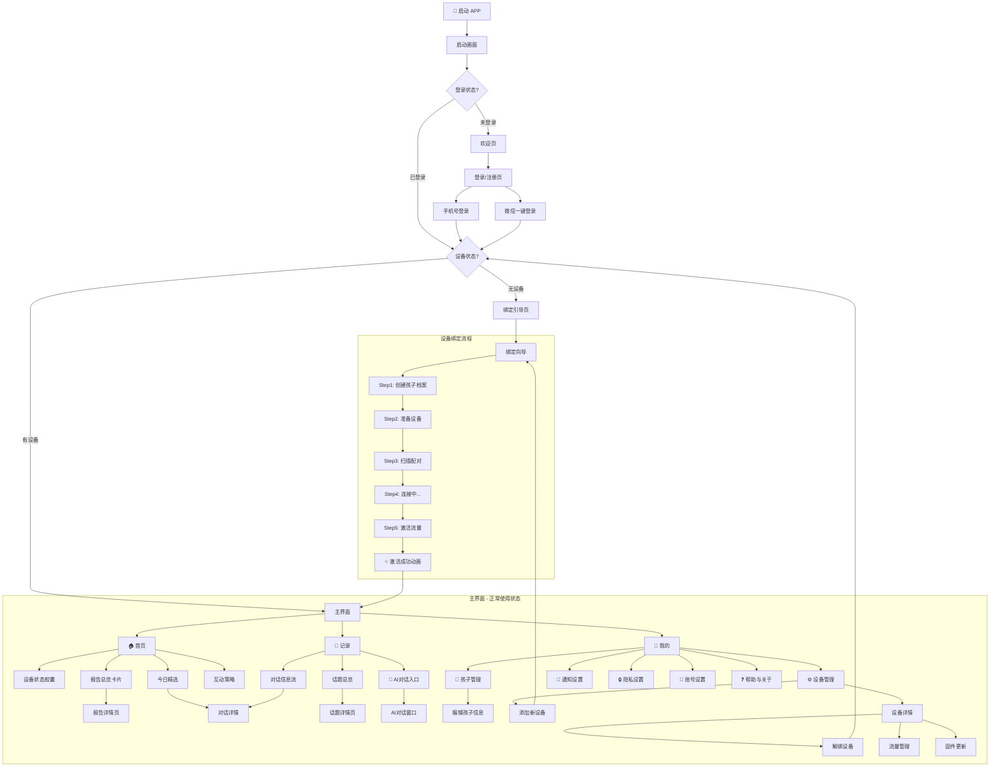

# APP 信息架构 (Information Architecture)

> **关联文档**：
> - [APP功能规格](./01-app-features.md)
> - [用户旅程地图](./02-user-journey.md)
> 
> **更新日期**：2025-02-05
> **重大变更**：新增未登录状态、完整设备绑定流程、激活成功动画

---

## 一、应用状态定义

### 1.1 用户状态流转

### 1.2 状态说明

| 状态 | 进入条件 | 可见内容 | 核心操作 |
|------|---------|---------|---------|
| **未登录** | 首次打开/退出登录 | 欢迎页、登录页 | 登录/注册 |
| **已登录未绑定** | 登录成功但无设备 | 绑定引导页 | 绑定设备 |
| **设备绑定中** | 开始绑定流程 | 绑定向导页 | 完成绑定步骤 |
| **激活成功** | 设备绑定成功 | 激活成功动画 | 自动跳转/点击进入 |
| **正常使用** | 有已绑定设备 | 完整3 Tab界面 | 全部功能 |

---

## 二、全局导航设计

### 2.1 导航模式
采用 **底部标签栏 (Bottom Tab Bar)** 作为一级导航，辅以 **顶部导航栏 (Top Navigation Bar)** 进行层级深入。

**重要**：底部导航仅在「正常使用」状态下显示，未登录和绑定流程中不显示。

### 2.2 底部标签定义 (Tab Bar) - 3 Tab架构

| 图标 | 名称 | 核心功能 | 选中态说明 |
|------|------|---------|-----------|
| 🏠 | **首页 (Home)** | 设备状态、报告总览、今日精选、互动策略 | 快速了解孩子今天怎么了 |
| 💬 | **记录 (Records)** | 对话信息流、话题总结、AI对话入口 | 深度探索孩子的世界 |
| 👤 | **我的 (Mine)** | 孩子档案、设备管理、账号设置 | 低频但必要的配置项 |

---

## 三、站点地图 (Site Map)

---

## 四、页面详细结构

### 4.1 未登录状态页面

#### P-00 启动画面 (Splash Screen)
*   **时长**：1.5-2秒
*   **内容**：品牌Logo + 产品名称 "小星伴"
*   **动画**：Logo呼吸闪烁效果
*   **背景**：渐变色（品牌主色调）

#### P-01 欢迎页 (Welcome Page)
*   **定位**：产品价值展示，引导用户登录
*   **内容**：
    *   品牌IP形象大图
    *   产品Slogan："读懂孩子，陪伴成长"
    *   核心价值点（3个轮播卡片）
        *   "听懂孩子的心声"
        *   "科学育儿建议"
        *   "记录成长轨迹"
*   **操作**：
    *   [开始使用] → 登录页
    *   [了解更多] → 产品介绍页（可选）

#### P-02 登录/注册页 (Login Page)
*   **登录方式**：
    *   手机号 + 验证码（主要）
    *   微信一键登录（快捷）
*   **表单**：
    *   手机号输入框
    *   验证码输入框 + 获取按钮（60s倒计时）
*   **协议**：
    *   勾选框 + 《用户协议》《隐私政策》链接
*   **按钮**：[登录/注册] （手机号自动判断新老用户）

---

### 4.2 设备绑定流程页面

#### P-10 绑定引导页 (Binding Guide)
*   **定位**：引导新用户开始绑定设备
*   **内容**：
    *   IP形象插图（小星伴等待连接）
    *   标题："让我们开始吧！"
    *   说明文案："连接小星伴，开启孩子成长记录之旅"
    *   设备准备检查清单：
        *   ✅ 确保设备已充电
        *   ✅ 将设备放在身边
*   **操作**：
    *   [开始绑定] → 绑定向导 Step1
    *   [稍后绑定] → 返回（但功能受限提示）

#### P-11 绑定向导 - Step1: 创建孩子档案
*   **进度指示**：Step 1/5
*   **标题**："告诉我们关于孩子的信息"
*   **表单**：
    *   孩子昵称（必填）- 用于AI称呼
    *   孩子姓名（选填）- 正式档案
    *   生日（必填）- 用于年龄计算
    *   性别（必填）- 用于AI语境
    *   头像（选填）- 可上传或选择预设
*   **说明**："这些信息帮助AI更好地理解您的孩子"
*   **操作**：[下一步] / [返回]

#### P-12 绑定向导 - Step2: 准备设备
*   **进度指示**：Step 2/5
*   **标题**："准备您的小星伴"
*   **内容**：
    *   设备示意图/动画
    *   操作指引：
        1. 找到设备底部的电源开关
        2. 长按开关 3 秒，直到指示灯亮起
        3. 确保设备在手机附近（1米内）
*   **动画**：循环播放开机操作动画
*   **提示**："设备指示灯闪烁蓝色表示已就绪"
*   **操作**：[设备已就绪，开始扫描] / [返回]

#### P-13 绑定向导 - Step3: 扫描配对
*   **进度指示**：Step 3/5
*   **标题**："正在搜索小星伴..."
*   **内容**：
    *   扫描动画（雷达波扩散效果）
    *   搜索状态文案
*   **发现设备后**：
    *   弹出设备卡片："发现设备：小星伴-XXXX"
    *   设备信息预览（型号、信号强度）
    *   [连接此设备] 按钮
*   **超时处理**（30秒）：
    *   "未找到设备" 提示
    *   [重新扫描] / [查看帮助]
*   **帮助入口**：常见问题FAQ

#### P-14 绑定向导 - Step4: 连接中
*   **进度指示**：Step 4/5
*   **标题**："正在连接..."
*   **内容**：
    *   连接进度动画（小星伴IP与手机握手）
    *   状态文案动态变化：
        1. "正在建立连接..."
        2. "正在验证设备..."
        3. "正在同步信息..."
        4. "连接成功！"
*   **预计时长**：5-15秒
*   **失败处理**：
    *   "连接失败，请重试"
    *   [重试] / [联系客服]

#### P-15 绑定向导 - Step5: 激活服务
> **设计原则**：绑定流程中不展示任何价格信息

*   **进度指示**：Step 5/5
*   **标题**："即将完成！"
*   **内容**：
    *   设备状态确认：
        *   ✓ 设备已连接
        *   ✓ 信息已同步
    *   功能说明（无价格）：
        *   "全天候陪伴对话"
        *   "自动记录成长点滴"
        *   "生成每日成长报告"
*   **操作**：
    *   [激活小星伴] → 激活成功动画
    *   激活过程约3-5秒
*   **注意**：价格信息仅在"我的→会员中心"展示

#### P-16 激活成功动画页 ✨
*   **定位**：庆祝时刻，增强用户成就感
*   **动画设计**（炫酷动效）：
    1. **星星绽放**（0-1s）：
       - 屏幕中心出现小星伴IP
       - 周围星星粒子爆发散开
    2. **光环扩散**（1-2s）：
       - IP形象发出光环波纹
       - 彩色渐变光效流动
    3. **成功标识**（2-3s）：
       - "激活成功！" 文字弹出
       - 金色勋章/徽章效果
    4. **祝福语**（3-4s）：
       - "小星伴已准备好"
       - "开启孩子成长记录之旅"
    5. **引导按钮**（4s后）：
       - [开始探索] 按钮渐显
       - 或 5秒后自动跳转首页
*   **音效**：轻快的成功音效（可选）
*   **背景**：渐变星空/彩带飘落效果

---

### 4.3 🏠 首页 (Home) - 正常使用状态

> **设计目标**：一眼看清"孩子今天怎么了"和"怎么和孩子互动"。

#### P-20 首页概览

*   **顶部栏**
    *   左侧：孩子头像 + 昵称（多孩子场景可切换）
    *   右侧：设备状态胶囊（🟢 80% 📶）
*   **区域 1：快捷入口 (Quick Access)V2**
    *   **📅 成长日历 (P-50)**：按月查看心情/里程碑
    *   **📂 历史档案 (P-51)**：列表查看所有历史报告
    *   **🔋 家长能量站**：Parent Battery Check-in
*   **区域 2：今日精选**
    *   2-3条关键对话卡片
    *   时间 + 场景 + 内容摘要 + 标签
*   **区域 3：互动策略** ⭐ 核心价值
    *   针对今日事件的育儿建议卡片
    *   可展开查看详情和对话模板
    *   [复制话术] 快捷操作

#### P-21 报告详情页
*   **Header**：日期、星期
*   **模块 A：今日总结**
*   **模块 B：情绪分析**（环形图）
*   **模块 C：关键事件列表**
*   **模块 D：话题云**
*   **模块 E：完整互动建议 (Parenting Guide)**
    *   **核心理念**：提供方法论而非单纯的话术。
    *   **家长须知(Why)**：解释行为背后的心理学/教育学原理。
    *   **互动策略(How)**：具体的引导技巧（如：接纳情绪、启发式提问）。
    *   **对话灵感(What)**：提供开放式的开场白建议，帮助建立话题。

---

### 4.4 💬 记录 (Records) - 核心交互区

> **设计目标**：孩子的"数据库"，父母可以深度探索，也可以直接和AI对话。

#### P-30 记录主页
*   **顶部**：搜索入口
*   **话题总览**：标签云（按热度排序）
*   **对话信息流**：
    *   按日期分组
    *   每条包含：时间、场景、对话内容、标签、AI洞察
    *   支持筛选
*   **底部固定**：AI对话入口栏
    *   输入框："问问小星伴..."
    *   语音输入按钮
    *   发送按钮

#### P-31 话题详情页
*   点击话题标签进入
*   **统计信息**：提及次数、首次提及、热度趋势
*   **AI洞察**：关于此话题的深度分析
*   **相关对话**：按时间倒序

#### P-32 AI对话窗口
*   **聊天界面**：
    *   系统欢迎语（介绍AI能力）
    *   对话气泡（用户/AI）
*   **输入区**：
    *   文字输入
    *   语音输入
*   **快捷问题**：预设问题示例

---

### 4.5 👤 我的 (Mine)

#### P-40 个人中心
*   **用户信息卡片**：头像、昵称、手机号
*   **会员状态卡片**（新增）：
    *   ⭐ 当前会员等级（体验会员/正式会员）
    *   有效期至 YYYY-MM-DD
    *   点击 → P-43 会员中心
*   **功能列表**：
    *   👶 孩子管理
    *   ⚙️ 设备管理
    *   🔔 通知设置
    *   🔒 隐私设置
    *   📱 账号设置
    *   ❓ 帮助与反馈
    *   ℹ️ 关于小星伴
*   **底部**：版本号

#### P-41 孩子管理
*   **孩子列表**：当前绑定的孩子
*   **编辑功能**：修改昵称、姓名、生日、头像
*   **兴趣标签**：AI自动识别（可删除/置顶）

#### P-42 设备管理
*   **设备卡片**：
    *   设备名称、型号
    *   实时状态（在线/离线）
    *   电量、信号
*   **操作列表**：
    *   固件更新
    *   设备重命名
    *   解绑设备
    *   添加新设备 → 进入绑定流程

#### P-43 会员中心（新增）
> **设计原则**：价格信息只在用户主动进入此页面后展示

*   **当前状态**：
    *   会员等级（体验会员/月度会员/年度会员）
    *   有效期、剩余天数
*   **我的权益**：
    *   当前拥有的所有功能权益列表
*   **续费方案**（价格在此展示）：
    *   **年度会员 ¥299/年**（推荐）
        *   相当于 ¥24.9/月
        *   通用权益 + 年度成长报告 + 孩子成长档案总结
    *   **月度会员 ¥29.9/月**（原价¥39.9）
        *   自动续费，可随时取消
        *   通用权益
*   **通用权益**：
    *   4G流量全包含
    *   无限对话次数
    *   无限每日报告生成
*   **温馨提示**：到期提醒、自动续费说明

---

## 五、核心交互流程 (User Flow)

### 5.1 首次启动完整流程

### 5.2 设备绑定详细流程 (BLE + Cloud)

### 5.3 日常使用流程

### 5.4 解绑与重新绑定流程

---

## 六、页面清单总览

| 页面ID | 页面名称 | 所属状态 | 优先级 |
|--------|---------|---------|--------|
| P-00 | 启动画面 | 通用 | P0 |
| P-01 | 欢迎页 | 未登录 | P0 |
| P-02 | 登录/注册页 | 未登录 | P0 |
| P-10 | 绑定引导页 | 已登录未绑定 | P0 |
| P-11 | 绑定向导-孩子档案 | 绑定流程 | P0 |
| P-12 | 绑定向导-准备设备 | 绑定流程 | P0 |
| P-13 | 绑定向导-扫描配对 | 绑定流程 | P0 |
| P-14 | 绑定向导-连接中 | 绑定流程 | P0 |
| P-15 | 绑定向导-激活流量 | 绑定流程 | P0 |
| P-16 | 激活成功动画 | 绑定流程 | P0 |
| P-20 | 首页 | 正常使用 | P0 |
| P-21 | 报告详情页 | 正常使用 | P0 |
| P-30 | 记录主页 | 正常使用 | P0 |
| P-31 | 话题详情页 | 正常使用 | P1 |
| P-32 | AI对话窗口 | 正常使用 | P0 |
| P-40 | 我的-个人中心 | 正常使用 | P0 |
| P-41 | 孩子管理 | 正常使用 | P1 |
| P-42 | 设备管理 | 正常使用 | P0 |
| P-50 | 成长日历 | 正常使用 | P1 |
| P-51 | 历史档案列表 | 正常使用 | P1 |

---

## 七、下一步

*   基于此架构图，更新 **线框图 (Wireframes)** 文档，补充未登录和绑定流程页面。
*   设计 **激活成功动画** 的具体视觉效果和动效参数。
*   与开发团队评审绑定流程的技术可行性。